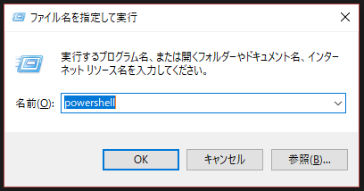
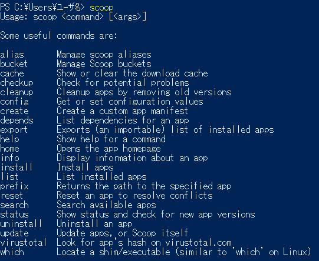
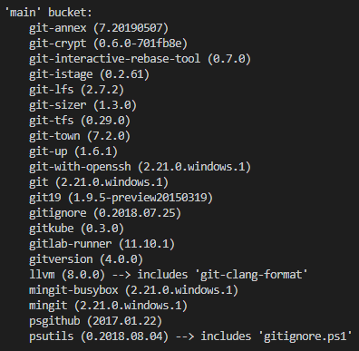
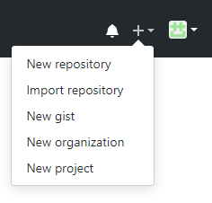
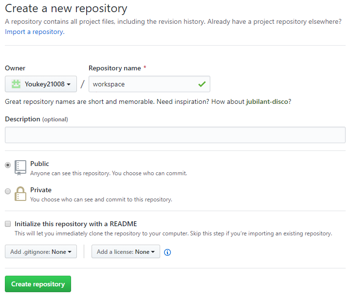

# workspace

## 開発の記録

### 開発環境（2019-05-12時点）
    
    OS : Windows10

使用ツール
    
    コマンドプロンプト（基本的な作業）
    Powershell（インストール用）
    GitHub
    VScode


### Gitが使えるようになるまで
1. Powershellを起動する。

    

2. scoopのインストール  
    
    まずは実行ポリシー変更を行う。
    ```
    Set-ExecutionPolicy RemoteSigned -scope CurrentUser
    ```
    を入力すると以下が表示される。
    ```
    実行ポリシーの変更
    実行ポリシーは、信頼されていないスクリプトからの保護に役立ちます。実行ポリシーを変更すると、about_Execution_Policies
    のヘルプ トピック (http://go.microsoft.com/fwlink/?LinkID=135170)
    で説明されているセキュリティ上の危険にさらされる可能性があります。実行ポリシーを変更しますか?
    [Y] はい(Y)  [A] すべて続行(A)  [N] いいえ(N)  [L] すべて無視(L)  [S] 中断(S)  [?] ヘルプ (既定値は "N"):
    ```
    「Y」を入力して変更したら、次に以下を入力。
    ```
    iex (new-object net.webclient).downloadstring('https://get.scoop.sh')
    ```
    scoopと入力して以下の様に表示されればインストール完了。

    

3. gitのインストール

    `scoop search git`と入力すると

    

    と出てくるので、`scoop install git`でgitをインストールして完了。

4. gitリポジトリの作成

    **リモートリポジトリの作成**  
    
    画面右上にある＋をクリックし"New repository"を選択  
      
    
    Repository nameにを"workspace(分かりやすくローカルリポジトリ名と同じにしている)"を入力する  
    他は特に入力しなくてもよい  
      
    
    Create Repositoryをクリックすると作成できる  

    **ローカルリポジトリの作成**

    リモートリポジトリを作成すると以下のメッセージが現れる  
    **…or create a new repository on the command line**
    ```
    echo "# workspace" >> README.md
    git init
    git add README.md
    git commit -m "first commit"
    git remote add origin https://github.com/Youkey21008/workspace.git
    git push -u origin master
    ```
    もしくは
    ```
    git clone https://github.com/Youkey21008/workspace.git
    ```
    をコマンドプロンプトに入力するとリモートと紐づけられたローカルリポジトリが作成される
